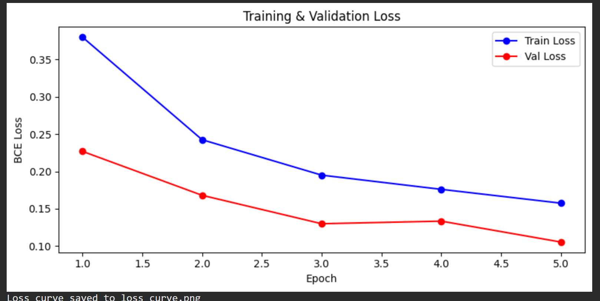
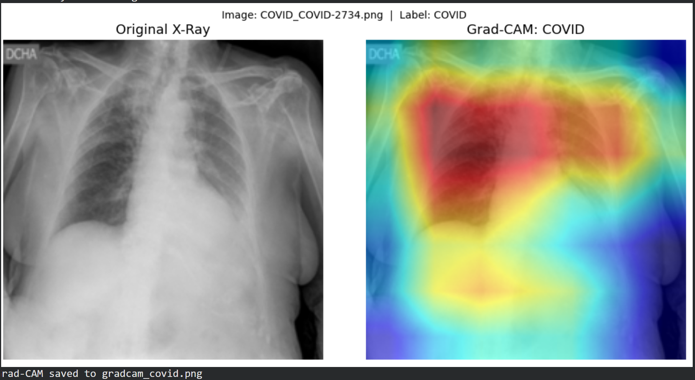

# AI Health Triage System (Chest X-ray Classification)

An AI-powered medical imaging system for detecting respiratory diseases from chest X-ray images using deep learning.  
The project uses **self-supervised learning (SimCLR)** for representation learning and **DenseNet121** for classification.

The model can classify chest X-rays into:

- COVID-19
- Viral Pneumonia
- Lung Opacity
- Normal

---

## Project Motivation

Early detection of respiratory diseases using chest X-rays can help triage patients faster in hospitals.  
This project explores how **self-supervised learning (SimCLR)** can improve feature extraction for medical image classification.

---

## Dataset

Dataset used:

**COVID-19 Radiography Database (Kaggle)**

https://www.kaggle.com/datasets/tawsifurrahman/covid19-radiography-database

The dataset contains thousands of labeled chest X-ray images for:

- COVID
- Viral Pneumonia
- Lung Opacity
- Normal

---

## Model Architecture

Backbone Network:
- DenseNet121

Training Strategy:
1. **Self-supervised pretraining using SimCLR**
2. **Supervised fine-tuning for classification**

Framework:
- PyTorch

---

## SimCLR Pretraining Results

Contrastive loss decreased across epochs:

| Epoch | Contrastive Loss |
|------|------------------|
| 1 | 2.2329 |
| 2 | 1.9812 |
| 3 | 1.9279 |
| 4 | 1.9027 |
| 5 | 1.9000 |

The pretrained encoder was saved as:simclr_encoder.pth

---

## Supervised Training Results

| Epoch | Train Loss | Validation Loss |
|------|-------------|----------------|
| 1 | 0.3796 | 0.2268 |
| 2 | 0.2424 | 0.1681 |
| 3 | 0.1950 | 0.1300 |
| 4 | 0.1760 | 0.1335 |
| 5 | 0.1576 | **0.1055** |

Best validation loss achieved: **0.1055**

---

## Training Curve

The graph shows decreasing training and validation loss, indicating effective learning without major overfitting.

---

## Model Explainability (Grad-CAM)

To understand the model's predictions, Grad-CAM visualization was used.

The highlighted regions show where the model focuses when predicting COVID-19 from chest X-rays.

---

---

## Future Improvements

- Add Grad-CAM visualization for more samples
- Deploy model as a web application
- Add model evaluation metrics (Accuracy, F1-score, Confusion Matrix)
- Implement model explainability dashboard

---

## Author

Shipra Pathak  
Machine Learning & Deep Learning Enthusiast
